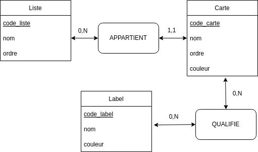

# MCD

Le MCD est la base obligatoire avant la création de la BDD.

## Cardinalités

Les cardinalités sont essentielles dans la définition des fonctionnalités à venir.

Par exemple :

- Dire qu'une carte n'a qu'un label nous force à vérifier si un label est présent sinon il ne faut pas laisser un utilisateur en placer un deuxième.

- Dire qu'une carte a N label est une solution plus simple au niveau fonctionnel (pas de vérification).